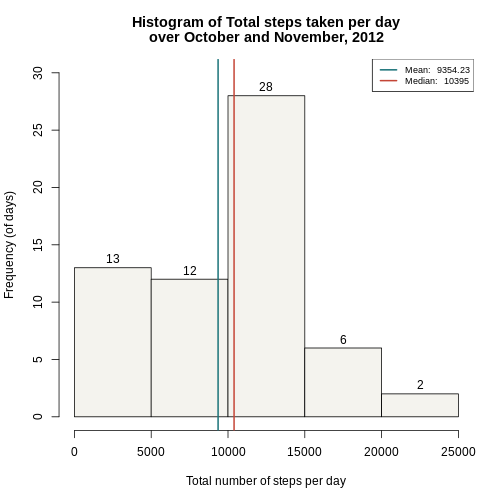
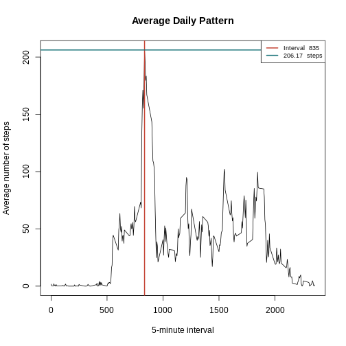
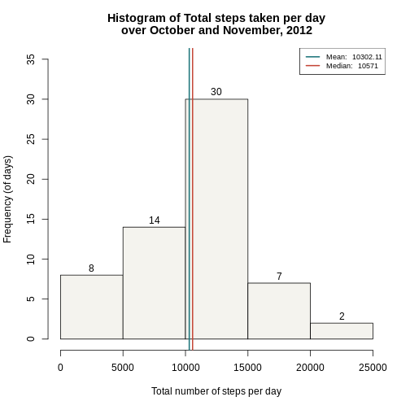
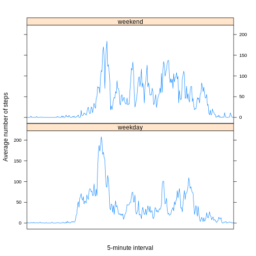

<div style="margin-bottom:30px;">
### Libraries Used


```r
library(dplyr)
library(lattice)
```
</div>

<div style="margin-bottom:50px;">
### About the Data

The dataset consists of the number of steps taken by an individual during 5 minute intervals.  
These records are made for all the days of October and November, 2012.
</div>

### Loading the Data

<div style="margin-bottom:50px;">

```r
data <- read.csv("activity.csv")
data$interval <- as.factor(data$interval)
str(data)
```

```
## 'data.frame':	17568 obs. of  3 variables:
##  $ steps   : int  NA NA NA NA NA NA NA NA NA NA ...
##  $ date    : Factor w/ 61 levels "2012-10-01","2012-10-02",..: 1 1 1 1 1 1 1 1 1 1 ...
##  $ interval: Factor w/ 288 levels "0","5","10","15",..: 1 2 3 4 5 6 7 8 9 10 ...
```
</div>

### Total Steps Per Day

To calculate the total steps taken per day, steps need to be summed by each day.

<div style="margin-bottom:20px;">

```r
daily_steps <- tapply(data$steps, data$date, FUN = sum, na.rm = TRUE)  
summary(daily_steps)
```

```
##    Min. 1st Qu.  Median    Mean 3rd Qu.    Max. 
##       0    6778   10395    9354   12811   21194
```
</div>

#### Histogram of the total number of steps taken per day

<div style="margin-bottom:50px;">

```r
hist(daily_steps, main = c(paste("Histogram of Total steps taken per day"), paste("over October and November, 2012")), xlab = "Total number of steps per day", ylab = "Frequency (of days)", labels = TRUE, ylim = c(0, 30), col = "#f4f3ee")
abline(v = mean(daily_steps), col = "#197278", lwd = 2)
abline(v = median(daily_steps), col = "#c44536", lwd = 2)
legend("topright", legend = c(paste("Mean: ", round(mean(daily_steps), 2)), paste("Median: ", median(daily_steps))), lwd = 2, col = c("#197278", "#c44536"), cex = 0.75)
```


</div>


### Average Daily Activity Pattern

To calculate average number of steps throughout the day, values are averaged by the 5-minute interval.

<div style="margin-bottom:20px;">

```r
avg_pttn <- tapply(data$steps, data$interval, FUN = mean, na.rm = TRUE)
```
</div>

#### Time series plot of average number of steps at each interval
<div style="margin-bottom:50px;">

```r
plot(names(avg_pttn), avg_pttn, type = "l", xlab = "5-minute interval", ylab = "Average number of steps", main = "Average Daily Pattern")
abline(v = names(avg_pttn)[avg_pttn == max(avg_pttn)], col = "#c44536", lwd = 2)
abline(h = max(avg_pttn), col = "#197278", lwd = 2)
legend("topright", legend = c(paste("Interval ", names(avg_pttn)[avg_pttn == max(avg_pttn)]), paste(round(max(avg_pttn), 2), " steps")), lwd = 2, col = c("#c44536", "#197278"), cex = 0.75)
```



The 5-minute interval which has the maximum number of steps is 835 with an average number of 206.17 steps, measured over October and November of 2012.

</div>

<div style = "margin-bottom:20px;">
### Input Missing Values
</div>

<div style = "margin-bottom:20px;">
#### Total number of rows with missing values
Calculated by checking the occurence of NA values.

```r
rows_na <- sum(!complete.cases(data))
```
Total number of missing value rows in the dataset = 2304.
</div>

<div style = "margin-bottom:20px;">
#### Strategy to fill NA values
Possible alternatives:
Fill in average values  
Front fill values  
Back fill values  
Copy all the interval values from the previous day  
</div>

<div style = "margin-bottom:20px; margin-top:20px;">

```r
s <- split(data, data$interval)
summary(s[["2230"]])
```

```
##      steps                 date       interval 
##  Min.   :  0.000   2012-10-01: 1   2230   :61  
##  1st Qu.:  0.000   2012-10-02: 1   0      : 0  
##  Median :  0.000   2012-10-03: 1   5      : 0  
##  Mean   :  9.755   2012-10-04: 1   10     : 0  
##  3rd Qu.:  0.000   2012-10-05: 1   15     : 0  
##  Max.   :396.000   2012-10-06: 1   20     : 0  
##  NA's   :8         (Other)   :55   (Other): 0
```
The dataset is split on the basis of the interval.  
From the printed example, it can be observed that the range of values is very wide and therefore, filling them in with the mean is not the best idea.  
NA values occur for the stretch of an entire day's readings at a time. Data for 8 such days is missing.  
A better alternative would be to front fill the values from the exact 5-minute interval on the previous day.  
It can be assumed that a person's activity would remain fairly consistent between two consecutive days.  
</div>

<div style = "margin-bottom:20px;">
#### Filling in the NA values 

```r
split_by_day <- split(data, data$date)
rep <- 1
for (day in 1:length(split_by_day)) {
     if(is.na(split_by_day[[day]][1, "steps"])) {
         if(day == 1)
             rep <- length(split_by_day)
         else
             rep <- day - 1
         split_by_day[[day]][, "steps"] <- split_by_day[[rep]][, "steps"]
     }
}
data <- bind_rows(split_by_day)
```
</div>


#### Histogram of the total number of steps taken per day

<div style="margin-bottom:50px;">

```r
new_daily_steps <- tapply(data$steps, data$date, FUN = sum, na.rm = TRUE) 
summary(daily_steps) 
```

```
##    Min. 1st Qu.  Median    Mean 3rd Qu.    Max. 
##       0    6778   10395    9354   12811   21194
```

```r
hist(new_daily_steps, main = c(paste("Histogram of Total steps taken per day"), paste("over October and November, 2012")), xlab = "Total number of steps per day", ylab = "Frequency (of days)", labels = TRUE, ylim = c(0, 35), col = "#f4f3ee")
abline(v = mean(new_daily_steps), col = "#197278", lwd = 2)
abline(v = median(new_daily_steps), col = "#c44536", lwd = 2)
legend("topright", legend = c(paste("Mean: ", round(mean(new_daily_steps), 2)), paste("Median: ", median(new_daily_steps))), lwd = 2, col = c("#197278", "#c44536"), cex = 0.75)
```


<div>


#### Changes in quantiles

<div style="margin-bottom:50px;">
The mean and median of the total number of steps taken per day have changed on replacing the missing values by the above chosen technique.  

```r
summary(new_daily_steps) - summary(daily_steps)
```

```
##    Min. 1st Qu.  Median    Mean 3rd Qu.    Max. 
##     0.0  1556.0   176.0   947.9    72.0     0.0
```
There is a general increase in most of the quantiles.
</div>

<div style = "margin-bottom:20px;">
### Weekdays and Weekends
</div>

<div style = "margin-bottom:20px;">
Classify the dates as weekdays and weekends.


```r
data$date <- as.Date(paste(data$date))
weekday <- c("Monday", "Tuesday", "Wednesday", "Thursday", "Friday")
data$day_type <- factor((weekdays(data$date) %in% weekday), levels=c(FALSE, TRUE), labels=c('weekend', 'weekday'))
```
</div>

<div style = "margin-bottom:20px;">
Average the number of steps based on the 5-minute interval.


```r
weekdays <- data[data$day_type == "weekday", ]
weekends <- data[data$day_type == "weekend", ]
weekday_avg <- tapply(weekdays$steps, weekdays$interval, FUN = mean, na.rm = TRUE)
weekend_avg <- tapply(weekends$steps, weekends$interval, FUN = mean, na.rm = TRUE)

data <- data.frame(interval = names(weekday_avg), day_type = rep("weekday"), avg_steps = weekday_avg)
data <- rbind(data, data.frame(interval = names(weekend_avg), day_type = rep("weekend"), avg_steps = weekend_avg))
```
</div>


#### Plotting the activity patterns between weekdays and weekends


```r
xyplot(avg_steps ~ interval | day_type, data = data, layout = c(1,2), type = "l", xlab = "5-minute interval", ylab = "Average number of steps", scales = list(x = list(at = c(), labels = c())))
```


